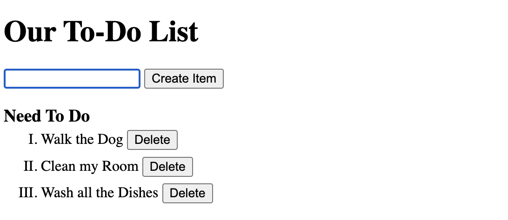
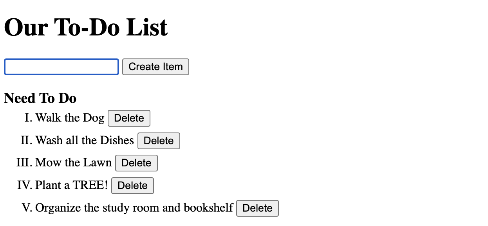

# Basic To-Do Website 📝 

&nbsp;&nbsp;&nbsp;&nbsp; A basic ToDo website that takes user input (one at a time) for things they need to do. Once user clicks submit button or presses ENTER key, the entry is added to the To-Do List. User can choose to delete items on the list if they want to by clicking the delete button.

### Main Concepts Used

In the **HTML file** mainly used:  

&nbsp;&nbsp;&nbsp;&nbsp;  The html FORM element: It provides a document section to take input from user. It provides various interactive controls for submitting information to a web server such as label, input, select, option, password, email etc. This project used: input and button tags as interactive controls for the form.
  
In the **JS file** mainly used:   
1. event.preventDefault() : We used this function to prevent the browser from sending the html form data somewhere else and refreshing the webpage when user clicks submit button. Using "event.preventDefault()" prevents this from happening since we DONT want to send html form data to a server.
2. We can access the user input data that they submitted from the form using the ".value" property of the input element object. 
3. Template Literals: Template literals are a new feature introduced in ECMAScript2015 (OR) ES6. It provides an easy way to create multiline strings and perform string interpolation. To either learn more about it OR check out its use cases click [here](https://www.programiz.com/javascript/template-literal) or [here](https://www.javatpoint.com/es6-template-literals).
4. (elementObject).insertAdjacentHTML() : The DOM insertAdjacentHTML() method is used to insert a text as HTML file to a specified position. This method is used to change or add text as HTML. 
5. .value = "" : After submit button is clicked since we don't need that user entry AGAIN so we delete it. This is better than having the user delete the entry they submitted to the form each time they have to add a new entry to the list.
6. .focus() : If user clicks submit button instead of pressing 'ENTER' key on keyboard, the text field wont be focused ANYMORE so user CAN'T immediately start typing their NEXT input to the form. Thus, we will add ".focus()" method to text field element object to prevent this.

**NOTE**: 1,2,4,5,6 points are methods,properties that are NOT inherent to JavaScript language but inherent to the web browser runtime environment.
 
## Deployment

Try out To Do List website here --> Demo: [ToDo Website](https://rahuls1428.github.io/Basic-ToDo-Website/)

## Built With

  * HTML - mainly used the FORM html element
  * CSS
  * JavaScript - used 2 important concepts: .insertAdjacentHTML() AND template literals

## Authors

  * **Rahul Solaiappan**

## Acknowledgments

  * Day 10: (Browser Practice) by LearnWebCode - YouTube
